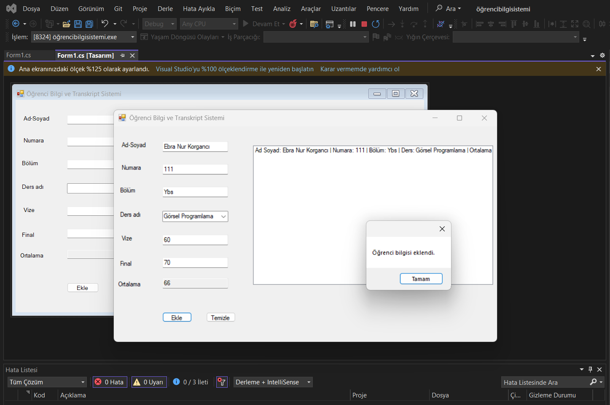

# Öğrenci Kayıt Sistemi

Bu proje C# Windows Forms kullanılarak geliştirilmiş basit bir öğrenci kayıt sistemidir.

## Projenin Özellikleri

- Öğrenci bilgisi ekleme
- Ders seçme
- Vize ve final notu girme
- Ortalama hesaplama
- Listeleme işlemleri

## Kullanılan Teknolojiler

- C#
- Windows Forms
- Visual Studio

## Projeyi Çalıştırma

1. Proje Visual Studio ile açılır.
2. .csproj dosyası çalıştırılır.
3. Start butonuna basılarak program çalıştırılır.

## Ekran Görüntüsü

